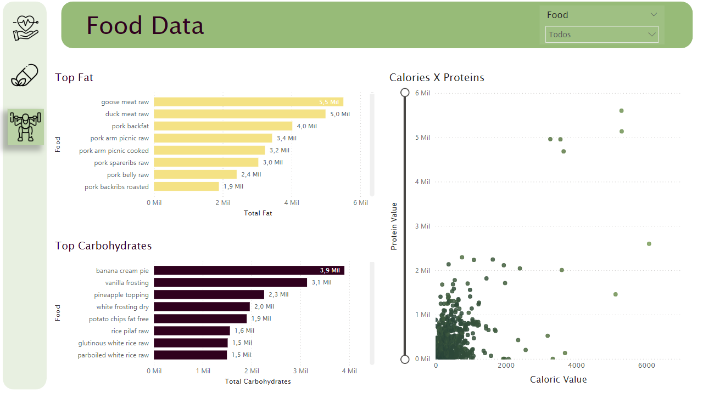
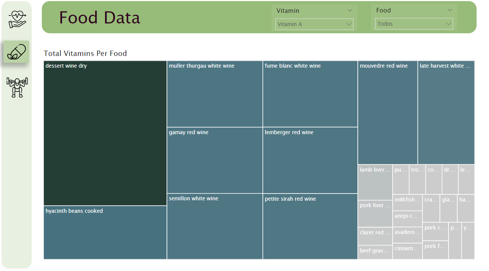
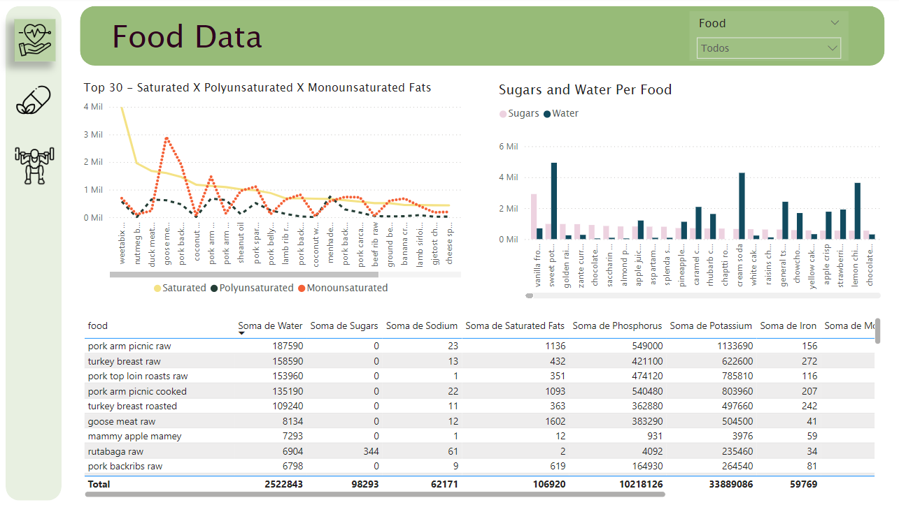

# Dashboard-of-Food
Dasboard with data of foods

<h2>Dataset</h2>

This work is based on the Kaggle dataset: https://www.kaggle.com/datasets/utsavdey1410/food-nutrition-dataset

<h2>Project</h2>

The project is divided into 3 sections: 

<li>Gym: focuses on the main nutrients related to muscle gain</li>
<li>Vitamins: aims to provide information about the quantity of vitamins in foods</li>
<li>Health: provides other information about a set of components, like water, fats, etc.</li>

<h2>Views</h2>

<h3>Gym</h3>

<h3>Vitamins</h3>

<h3>Health</h3>

